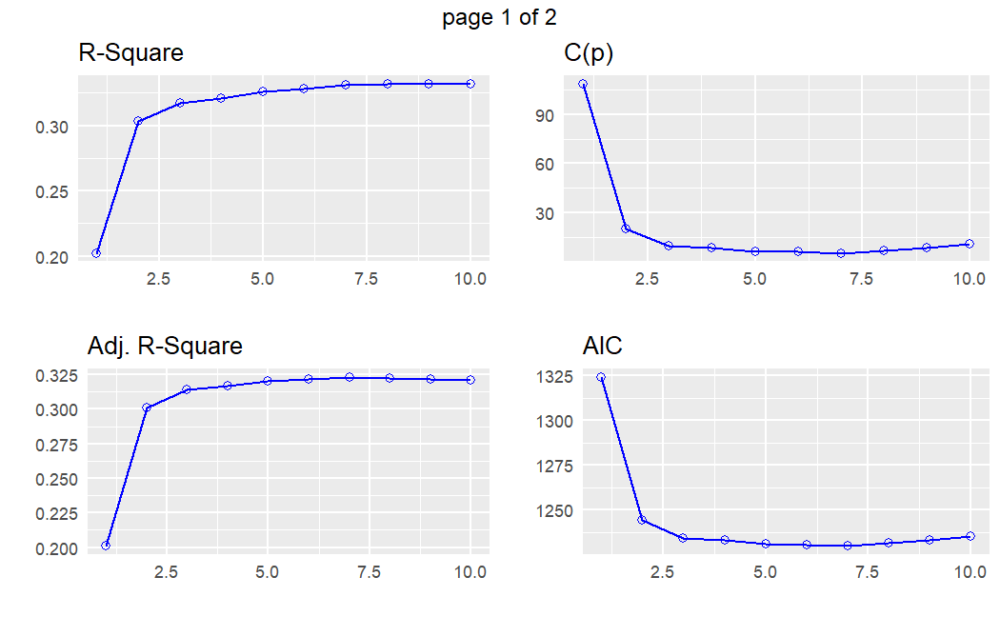
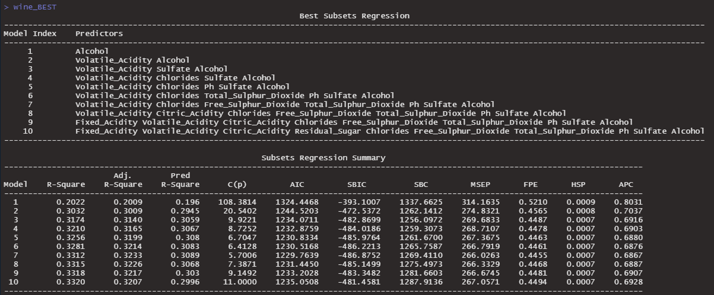

### Upcoming Dates

- Today's Lecture (3/21) is the third and final lecture on model and variable selection.

- **HW 7 was due on Monday, 3/20**. 

   - Grace Period is extended until Wednesday 3/22 at midnight, because of Spring Break.
   
<br>   
   
- **HW 8 is now posted and is due Monday, 3/27**

  - Part 1 pertains to Lectures 15 and 16 (today's lecture)

- Part 2 pertains to Lecture 17

<br>
  
  - **Quiz 2 is Thursday, March 30th**
  
  - Practice Questions will be posted by Friday

---
  
### Getting Started with Markdown (Updated)
  
  - Download Zipped R project 

- Open Zipped folder and copy internal folder (R Project) to a BUA 345 folder on your computer NOT IN DOWLOADS

- **Open R Project:**
  
  - *OPTION 1:* Click on .Rproj file to open project and RStudio

- *OPTION 2:* Open RStudio, then click File > Open Project > then navigate to  and click on .Rproj file.

<br>
  
- **Once Project is opened in RStudio:**
  
  - Click on `code_data_output` file to open it.

  - Click on `BUA_345_Lecture_16.Rmd` to open it.

  - Run `setup` Chunk


---
  
### Setup
  
- The setup chunk shows the packages needed for this demo.   

- R will install specified packages if needed (only required once after R is installed)  

- R will load specified packaged (required every time you start a new R session)  

- The first time you run this code, R will install these packages which will be slow.  

- **If you get warnings, that's okay.**  

- If you get **error messages**, I (or TA), can help you.


---

### Setup Chunk for Lecture 16

```{r setup for Lecture 16, include = T}

# this line specifies options for default options for all R Chunks
knitr::opts_chunk$set(echo=T, highlight=T)
# suppress scientific notation
options(scipen=100)

# install helper package that loads and installs other packages, if needed
if (!require("pacman")) install.packages("pacman", repos = "http://lib.stat.cmu.edu/R/CRAN/")

# install and load required packages
pacman::p_load(pacman,tidyverse, magrittr, olsrr, gridExtra, ggiraphExtra, knitr, viridis)

# verify packages
p_loaded()

```

**NOTES:

- ** Don't worry about `xaringanthemer` package (required for my slides but not for your code).

- If you are having trouble installing/loading any packages, please come to office hour or make an appointment with me or course TA.

---
  
### Lecture 16 In-class Exercises
  
#### **Question 1 (L16) - Session ID: bua345s23**
  
Review Question from Lecture 15 and HW 7.

If two predictor variables (X variables) in a model have a correlation of 0.85, what do you conclude?
  

---
  
### Animals Data Dictionary - Description of Variables
  
```{r animals data dictionary table, echo=F}
animals <- read_csv("animals.csv", show_col_types=F) 
Variable <- names(animals)
Type <- c("Nominal", rep("Quantitative", 8), rep("Ordinal", 3))
Description <- c("Name of Species",
                 "Total Sleep = sum of slow wave and paradoxical sleep (hrs/day)",
                 "Average Body Weight in kilograms",
                 "Natural Log of Body Weight",
                 "Average Brain Weight in grams",
                 "Natural Log of Brain Weight",
                 "Maximum Life Span in years",
                 "Natural Log of Life Span",
                 "Gestation Time in days",
                 "Predation Index (1 = least likely to be preyed upon, 5 = most likely)",
                 "Sleep Exposure Index (1 = least exposed while sleeping, 5 = most exposed",
                 "Overall Danger Index (1 = least danger from other animals, 5 = most most danger")

(animal_data_dictionary = tibble (Variable, Type, Description) |>
    kable())

```

---
  
### Reminder of Concerns
  
-   **LNBodyWt and LNBrainWt (R = 0.95):** These two predictors can not both be in the final model.
-   **LNBrainWt and LNLifeSpan (R = 0.79):** These two predictors ideally should not both be in the final model.
-   **Predation (PredF) and Danger (DangrF) (R = 0.95):** These two predictors can not both be in the final model.
-   **Exposure (ExposF) and Danger (DangrF) (R = 0.78):** These two predictors ideally should not both be in the final model.
- **NOTE:** Students should know the commands for creating a correlation matrix with rounded values.


```{r reminder of multicollinear quant terms}
animals <- animals |> filter(!is.na(LifeSpan) & !is.na(Gestation)) # exclude missing values
animals |> select(TotalSleep, LNBodyWt, LNBrainWt, LNLifeSpan) |> cor() |> round(2) |> kable()

```


```{r reminder of multicollinear cat terms}

animals |> select(Predation, Exposure, Danger) |> cor() |> round(2) |> kable()

```

---

### Review of Backward Elimination of Animals Data
  
-   After examining the data, we developed a full model and did Backward Elimination
-   We opted to exclude Danger (DangrF) because it was highly correlated with Predation
-   We opted to exclude LNBrainWt because it highly correlated with LNBodyWt and LNLifeSpan

```{r backward elim of animals data, echo=F}
animals <- animals |>                                              # create factor variables
  mutate(PredF = factor(Predation, levels=1:5), 
         ExposF = factor(Exposure, levels=1:5), 
         DangrF = factor(Danger, levels = 1:5))
animals_full <- lm(TotalSleep ~ LNBodyWt + LNLifeSpan + Gestation + PredF + ExposF +  # specify full model
                     LNBodyWt*Gestation + LNBodyWt*PredF + LNLifeSpan*PredF + LNLifeSpan*ExposF , data=animals)
(animals_BE <- ols_step_backward_p(animals_full, prem = 0.1))     # summary of backward elimination

```

---
  
  
### Model Selection Methods
  
- Recall that in Multiple Linear Regression (MLR) the goal is to choose the simplest most accurate model, i.e. the 'BEST' set of independent variables

- How do we decide which variables should be in our model?
  
  - There are many methods:
  
  - We've discussed Backward Elimination which can also be done manually in any software (not recommended).

- **Backward Elimination** starts with all potential terms (including potential interaction terms) in the model and removes the least significant term for each step.

   - This is referred to as starting with a **full** or **saturated** model.

- **Forward Selection:** By default, this procedure starts with an empty model and adds the most significant term at each step until there are no more useful terms to add.

   -  Forward selection also needs to know what terms are in the **full** model.

- **Stepwise Selection:** By default, this procedure starts with an empty model and then adds or removes a term for each step.

- Common Practice: Try multiple methods to develop preliminary final model and then tweak as needed.

---

### Notes about Model Selection using Multiple Methods

- These steps are similar to the steps for Backward Elimination.

- Not all steps are ALWAYS required. It depends on how complex the data are.

- In the following example, we only need to do part of Step 1 plus Steps 2, 3, and 6.

   -  For step 1, we only need to examine correlations.

   -  In this case, Step 7 will be apparent.

   -  We can add model estimates to data for future interpretation (Step 8)


---

### Steps for Model Selection Using Multiple Methods
                                    
**`1.`** Examine Matrix of Scatterplots and histograms and determine if any transformations are needed to linearize relationships between continuous predictors and response variable.

  - Also look at correlation matrix to check if there are pairs of variables to be concerned about.

**`2.`** Create a 'saturated' model with all potential predictor variables and interaction terms (Subjective!).

**`3.`**  Use **Backward Elimination**, **Forward Selection**, and **Stepwise Selection** to find preliminary candidate models. (These are automated procedures!)

  - Carefully examine results to see where these candidate models agree and disagree.

**`4.`** Examine predictors in preliminary candidate models to confirm they are not too highly correlated with each other.

  - If two predictor variables in any model have a correlation of 0.8 or greater, drop one of them.

**`5.`**  Rerun model selection methods, if a candidate model is substantially changed (not always needed).

**`6.`**  Compare model fit statistics from final candidate model from all three methods.

**`7.`**  Decide on final candidate and make final modifications, if needed.

**`8.`**  Interpret final model.

---

### Wine Data - Model Selection Example

***Can we determine what factors affect wine quality even if we KNOW NOTHING about wine cultivation and chemistry?***

**Maybe!**

- Since we have no prior knowledge, we start with a straightforward full model with all available predictors and no interactions.

  - In practice, a consultant would be working with a wine expert to carefully determine a saturated model that includes all possible interactions.


---

### Import Wine Data

-   Notice that all variables are numeric (*`<dbl>`* stands for decimal value).

```{r import and examine data}

wine <- read_csv("wine.csv", show_col_types = F) |>
  glimpse()

```

---

### Examine Correlation matrix for Multicollinearity 

```{r examine wine correlation matrix}
(cor_wine <- wine |> cor() |> round(2)) #  correlation matrix 
```


```{r max and min of wine cor matrix, results='hold'}
max(cor_wine[cor_wine < 1])
min(cor_wine)
```

---


### Model Selection

- We specify a full model using an easy shortcut:

   - If all variables are included, you can use `.` instead of listing them all.

- The we do three model selection procedures:

   - Backward Elimination (BE)
   - Forward Selection (FS)
   - Stepwise Selection (SS)

```{r specify full model}

wine_full <- lm(Wine_Quality ~ ., data = wine)                 # specify full model

wine_BE <- ols_step_backward_p(wine_full, progress=F)          # backward elimination  

wine_FS <- ols_step_forward_p(wine_full, progress=F)           # forward selection

wine_SS <- ols_step_both_p(wine_full, progress=F)              # stepwise selection

```

---

#### Comparing Model Results

- Look at the LAST step for each method to determine which method results in the best fit.

- Comparison Measures:

  - **Adj. R<sup>2</sup>:** Higher value indicates better model fit

  - **C(p):** Lower value indicates better model fit (Also referred to as Mallow's C(p)).

- **AIC:** Lower value indicates better model fit (Akaike Information Criteria).

- **RMSE:** Lower value indicates better model fit (Root mean Square Error).

- By comparing these measures and accounting for our understanding of these procedures, we can determine that **TWO** of these methods arrived at the same model.

### Lecture 16 In-class Exercises

#### **Question 1 (L15) - Session ID: bua345s23**

Which two model selection methods arrived at the same model for the wine data?
  
---

### Backwards Elimination, Forward Selection, & Stepwise Selection

```{r wine be fs, echo=F}
wine_BE
wine_FS
wine_SS

```
---

### Model Validation
  
```{r saving and examining final model results}

# create final model dataset save model
wine_model_data <- wine |> 
  select(!c("Residual_Sugar","Fixed_Acidity","Citric_Acidity"))

# create save final model
wine_model_final <- ols_regress(Wine_Quality ~ ., data=wine_model_data)
wine_model <- wine_model_final$model

# add final model estimates and residuals to dataset
wine_model_data <- wine_model_data |>   
  mutate(Est_Wine_Quality = lm(wine_model) |> predict(wine_model_data) |> round(2))

# calculate correlation between observed and estimated wine quality
wine_model_data |> select(Wine_Quality, Est_Wine_Quality) |> cor() |> round(2)

```

```{r plot code for model validation plot, echo=F}

pred_plot <- wine_model_data |>         # create model vaildation plot
  ggplot(aes(x=Wine_Quality, y=Est_Wine_Quality, color=Alcohol)) + 
  geom_point() +
  labs(x = "Wine Quality", y = "Est. Wine Quality", color="Alcohol %",
       "Wine Model Validation Plot") + 
  scale_color_viridis() +
  geom_jitter(width=0.1) +
  theme_classic() +
  theme(title = element_text(size=20),
        axis.title = element_text(size=18),
        axis.text = element_text(size=15),
        plot.background = element_rect(colour = "darkgrey", fill=NA, size=2))
```

---
  
### Model Validation Plot
  
```{r display of wine model validation scatterplot, echo=F, fig.align='center'}

pred_plot

```

---

### Best Subsets
  
- Another model selection method is 'Best Subsets'

- Output shows 'Best' one variable model, 'Best' two variable model, 'Best' three variable model, etc.

- Each 'Best' model is determined by multiple **Fit Statistics**.

- This method then examines which of these candidates is the overall best by comparing their fit statistics.

- If we are fortunate, the optimal choice from 'Best Subsets' matches a model above.

-  In this case (and HW 8) we are fortunate.

- NOTE: `ols_step_best_subset` command is **VERY** slow. You do not need to rerun it. Output is provided.

---
  
### Best Subsets PLots (Only Page 1 Plots Required for BUA 345)
  
```{r best subsets model selection, eval=FALSE}

wine_BEST <- ols_step_best_subset(wine_full)
plot(wine_BEST)

```

---
  
### Wine best Subset Plot
  
```{r  wine best subset plot output, echo=FALSE}



```

---
  
### Reading Best Subsets Output
  
#### Tabular Output
  
- Bottom table shows which model performs best, based on all of the fit statistics.

- For example, if model 3 (Three variable model) was best, it would have the HIGHEST Adjusted R<sup>2</sup>, Lowest C(p), and Lowest AIC.

- We can see from bottom table that **Model 3 is not the best**.

- **Model 7 IS the best** because it does have the HIGHEST Adjusted R<sup>2</sup>, Lowest C(p), and Lowest AIC.

- Top table lists the variables in each of the 'Best' models.


---
  
### Wine Best Subset Tabular Output
  
```{r  wine best subset output, echo=FALSE}



```

---
  
### **Key Points - Model Selection**
  
-  Regression modeling can be overwhelming because of all of the possible options.

- Automating part of the variable selection process is helpful.

- Trying different methods and comparing results is strongly recommended.

- Results from Automated processes are preliminary models that can (and should) be tinkered with.

- Once we have a final model we can add regression estimates and residuals to the dataset.

- Methods Covered: Backwards Elimination, Forward Selection, Stepwise Selection, Best Subsets 

- Compare results multiple methods 

<br>
  
  You may submit an 'Engagement Question' about each lecture until midnight on the day of the lecture. **A minimum of four submissions are required during the semester.**
